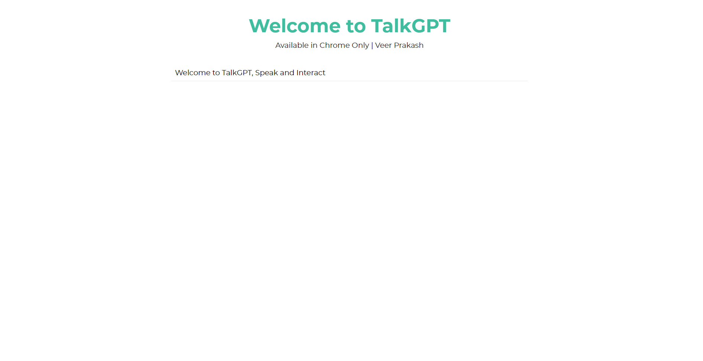
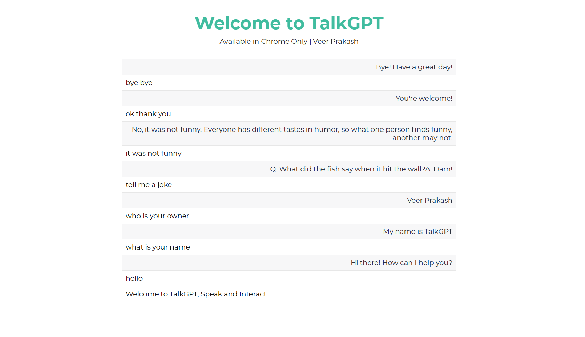

# talk-gpt

- TalkGPT: GPT Audio Web App
- Contains code for both backend and frontend service
- Talk and interact with GPT
- No contact app only speak and hear and interact

- **Updates: Using Gemini AI for getting the Response**

(Youtube) Live Site Working Demo: https://youtu.be/dM8aqY9MJsM

Live Site Link: https://veerprakash28.github.io/talk-gpt/

Backend Server Repo: https://github.com/veerprakash28/talk-gpt-server

## Steps to follow

For using the project, follow the following steps

- Run command `git clone https://github.com/veerprakash28/talk-gpt` to clone the git repo in your system
- Locate to the talk-gpt folder: `cd talk-gpt`
- Locate to the server folder: `cd server`
- Run command `npm i` to install node_modules
- Setup your .env file in server folder
- Add a .env file and there add your `PORT` number and Gemini API Key `GEMINI_API_KEY`
- Run `npm start` and your server will be running
  Your backend service is started

- Now run the `index.html` file to start the application
  If everything goes fine then this project will be cloned in your system

## Screenshots

### Home

### Conversation

